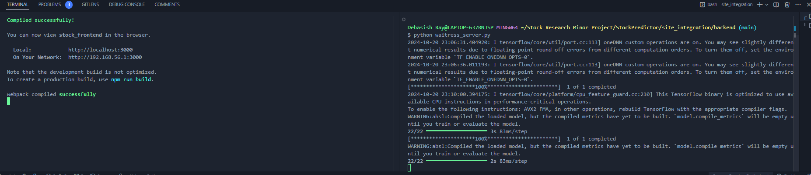
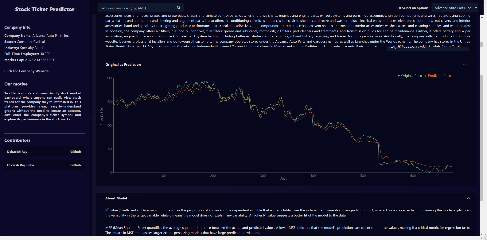

# About

About this project titled "Stock Ticker Analysis and Prediction System using Stacked LSTM" or **Ticker-Prediction System**. It works on LSTM architecture which is an advanced version of RNN (Type of Neural Navigated Network).

- In this project, we have incorporated different data-preprocessing techniques for continuous dataset value.
- Also, in this project, we have incorporated XG-Boost as ensemble method to increase accuracy of following LSTM model.

**NOTE: All test and research work are done and are pushed in different repository related to this project trained on different epoch cycles and parameters, which are usable with project.**

--> **<a href="https://github.com/debasishray16/Stock-Prediction-Models"> Link to Model Training Repository</a>**

## Description

- Our project works on concepts of deep learning to predict values based on time-series model. It includes use of LSTM (Long Short Term Memory) with XG-Boost to enhance the performance of prediction. Also, it takes tickers as input and gives prediction results.

- This repository invloves deployment of model with **two-interfaces**.
One with <kbd> Streamlit-App </kbd>  [**[Link](https://ticker-prediction-app-tpa.streamlit.app/)**] and <kbd> React App </kbd>

- For versioning of project deployement,We have created docker images for respective project to track and observe major changes made in the application.
Each of these images are tagged with different versions which can be easily pulled into your system.

## Installation

### 1. Running locally after cloning

To run this project as website on your local system.Follow the steps -

- Navigate to <kbd>Ticker Predictor Website</kbd> folder.

```bash
cd "Ticker Predictor Website"
```

- Now, navigate to <kbd> Front-end</kbd> folder.

```bash
cd "Front-end"
```

- Run command in  if project is cloned for first time. *This will install necessary node_modules folder in current folder.*

```bash
npm install
```

- Now to start the development server in React. Run the command:

```bash
npm run start
```

- Simultaneously, Run command in **another terminal** to start **backend server** created on python.
- Navigate to <kbd> Backend</kbd> folder and run bash command.

```bash
python waitress_server.py
```



```text
Note: This will start the server and will connect with React website directly, running on https://localhost/3000.
```

It should look like this after starting the server.



### 2. Running project using Docker

1. To run website located in <kbd> Ticker Predictor Website</kbd>. Follow these steps:

- Open docker desktop and start the docker engine.
- Open **one terminal** for backend and open **another terminal** for frontend image to run and execute container.

```bash
# Terminal 1
# this will pull and run latest deployed frontend container.
docker run -p 3000:3000 debasishray/predictor-frontend:latest
```

```bash
# Terminal 2
# this will pull and run latest deployed backend container
docker run -p 5000:5000 debasishray/predictor-backend:latest
```

- Now, navigate to any web-browser and type:

```text
https://localhost/3000
```

2. To run streamlit-webapp located in <kbd> Ticker Streamlit App</kbd> deployed on Docker. Follow these steps:

- Open docker desktop and start the docker engine.
- Open terminal and then, type the command:

```bash
# this will run latest deployed streamlit-app container
docker run -p 8501:8501 debasishray/streamlit-app:latest
```

- Then, click on link provided on docker terminal.

## Steps to deploy on Github Packages

1. Create a replica of Docker image with different tag.
2. Check the image created.
3. Authenticate by using **PAT (Personal Access Token)**.
4. Push that image in GitHub Packages.

```bash
docker tag debasishray/streamlit-app:v1.0 webapp

docker tag webapp ghcr.io/debasishray16/stockpredictor/webapp:latest
docker image ls

# For authentication
echo "pat-value" | docker login ghcr.io -u debasishray16 --password-stdin

# ghcr.io/<username>/<repository>
docker push ghcr.io/debasishray16/stockpredictor/webapp:latest
```

### Contributors

<div align="right">
 <a href="https://github.com/debasishray16/StockPredictor/graphs/contributors">
   
 </a>
</div>
